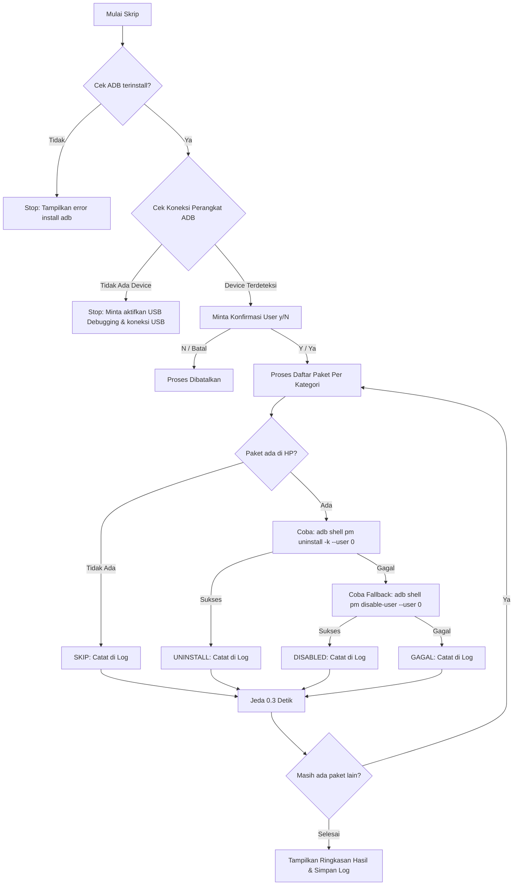

# 🚀 Redmi 9C Bloatware Remover (`uninstall_bloatware.sh`)

Skrip otomatis bash buat ngebasmi dan menonaktifkan aplikasi sampah (*bloatware*) bawaan HP Redmi 9C (MIUI / Android) lewat ADB. Bikin HP lu makin lega, enteng, dan bebas dari amukan iklan MIUI! 💥📱

---

## 📋 Fitur & Kategori yang Dibabat

Skrip ini mengelompokkan paket bloatware ke dalam beberapa kategori:
- 🌐 **Google Bloatware** (YouTube Music, Google Pay, Digital Wellbeing, Voice/TTS, dll.)
- 📱 **MIUI / Xiaomi Bloatware** (Glance / Komedi Putar Wallpaper, Mi Cloud, MSA/Iklan, Mi Pay, GetApps, Yellow Pages, dll.)
- 🤖 **Aplikasi Bawaan Android** (Easter Egg, Sound Recorder, Live Wallpaper picker, dll.)
- 🛍️ **Aplikasi Pihak Ketiga Pra-install** (Facebook Services/App Manager, Amazon, LinkedIn, Netflix, WPS Office)
- 🎨 **MIUI Themes & Icon Packs** (Theme Manager & variasi warna/ikon bawaan)
- 🌐 **Mi Browser**
- 📝 **Mi Notes**
- 🎵 **Mi Music**

> ⚠️ **Catatan Keamanan:** Aplikasi penting seperti `com.xiaomi.finddevice`, `com.google.android.syncadapters.contacts`, atau Chrome sengaja di-comment / dikecualikan biar HP lu kaga bootloop atau kehilangan kontak penting!

---

## 🛠️ Persyaratan & Cara Install

### 1. Prasyarat Sistem (di Komputer/Laptop)
Komputer lu wajib punya **ADB (Android Debug Bridge)**.

- **Ubuntu / Debian / Linux Mint:**
  ```bash
  sudo apt update && sudo apt install adb -y
  ```
- **Arch Linux:**
  ```bash
  sudo pacman -S android-tools
  ```
- **Fedora:**
  ```bash
  sudo dnf install android-tools
  ```

### 2. Persiapan di HP (Redmi 9C / Android)
1. Buka **Setelan (Settings)** ➡️ **Tentang Ponsel (About Phone)**.
2. Ketuk **Versi MIUI (MIUI Version)** sebanyak **7 kali** sampai muncul notifikasi *"Anda adalah seorang pengembang!"*.
3. Kembali ke Setelan ➡️ **Setelan Tambahan (Additional Settings)** ➡️ **Opsi Pengembang (Developer Options)**.
4. Aktifkan **Debug USB (USB Debugging)**.
5. Hubungkan HP ke laptop/komputer pakai kabel data USB.
6. Saat muncul pop-up di layar HP *"Izinkan Debugging USB?"*, centang *"Selalu izinkan dari komputer ini"* lalu tekan **OK / Izinkan**.

### 3. Mengunduh & Menyiapkan Skrip
Clone repo ini atau simpan skrip ke komputer lu, lalu berikan izin eksekusi:

```bash
chmod +x uninstall_bloatware.sh
```

---

## ⚙️ Cara Kerja Skrip

Skrip `uninstall_bloatware.sh` bekerja dengan alur kerja cerdas & aman sebagai berikut:



### Penjelasan Detail Mekanisme:
1. **Pemeriksaan Lingkungan (Pre-flight Check):**
   - Menguji apakah perintah `adb` tersedia di sistem.
   - Menguji ketersediaan perangkat HP yang terhubung via `adb devices`.
2. **Konfirmasi Pengguna:**
   - Menampilkan jumlah paket yang akan diproses dan meminta konfirmasi `y/N` agar tidak berjalan secara tak sengaja.
3. **Pemeriksaan Keberadaan Paket (`is_installed`):**
   - Sebelum mengeksekusi hapus, skrip ngecek dulu keberadaan paket pake perintah `adb shell pm list packages --user 0`.
   - Kalau aplikasi memang kaga ada dari awal, bakal di-**SKIP** biar menghemat waktu.
4. **Mekanisme Hapus Aman (`--user 0`):**
   - Skrip menjalankan perintah: `adb shell pm uninstall -k --user 0 <nama.paket>`
   - Bendera `--user 0` artinya aplikasi hanya dihapus dari profil pengguna utama. Aplikasi sistem tidak dihapus secara permanen dari partisi `/system` (sehingga **tetap aman**, kaga bakal bikin HP brick/mati total, dan bisa di-restore kalau mau).
5. **Mekanisme Cadangan / Fallback (Auto-Disable):**
   - Kalau proses `uninstall` gagal (misal diblokir oleh OS), skrip secara otomatis mencoba cara kedua yaitu **menonaktifkan** aplikasi: `adb shell pm disable-user --user 0 <nama.paket>`
6. **Logging & Jeda (Anti-Crash):**
   - Ada jeda `0.3` detik antar perintah (`DELAY=0.3`) biar koneksi ADB dan OS HP kaga *stress* / *lag*.
   - Setiap tindakan (`UNINSTALL`, `DISABLED`, `SKIP`, `GAGAL`) langsung dicatat secara real-time ke file `bloatware_log.txt` beserta timestamp lengkap.
7. **Laporan Ringkasan (Summary Report):**
   - Di akhir proses, skrip menghitung total paket dan menampilkan ringkasan berwarna (Total diproses, Berhasil uninstall, Di-disable, Di-skip, dan Gagal).

---

## ▶️ Cara Menggunakan Skrip

Jalankan skrip lewat terminal:

```bash
./uninstall_bloatware.sh
```
atau:
```bash
bash uninstall_bloatware.sh
```

**Contoh Output di Terminal:**
```text
╔══════════════════════════════════════════════════════╗
║       Redmi 9C Bloatware Remover — via ADB          ║
╚══════════════════════════════════════════════════════╝

[*] Memeriksa koneksi perangkat...
[OK] Perangkat terdeteksi.
List of devices attached
da88722a0408    device

[!] PERINGATAN: Skrip akan menghapus/menonaktifkan 94 paket.
    Gunakan --user 0 (aman, tidak hapus permanen dari ROM).

Lanjutkan? (y/N): y

[Google Bloatware]
  [UNINSTALL] com.google.android.apps.subscriptions.red ✓
  [SKIP]  com.google.android.apps.walletnfcrel (tidak ditemukan)
  ...

══════════════════════════════════════
  RINGKASAN HASIL
══════════════════════════════════════
  Total paket diproses : 94
  ✓ Berhasil uninstall : 45
  ⚠ Di-disable         : 5
  ↷ Di-skip            : 44
  ✗ Gagal total        : 0

  Log lengkap tersimpan di: /path/to/bloatware_log.txt
```

---

## 📄 File Log (`bloatware_log.txt`)

Setiap kali skrip dijalankan, file `bloatware_log.txt` bakal otomatis dibuat/diperbarui di direktori yang sama.

Contoh isi log:
```text
======================================
 Bloatware Remover Log — 2026-07-27 16:00:00
======================================
[2026-07-27 16:00:01] [UNINSTALL] com.miui.analytics — Berhasil di-uninstall
[2026-07-27 16:00:02] [DISABLED] com.miui.msa.global — Uninstall gagal → di-disable | Detail: Failure [DELETE_FAILED_INTERNAL_ERROR]
[2026-07-27 16:00:03] [SKIP] com.amazon.mShop.android.shopping — Paket tidak ditemukan di perangkat
```

---

## ↩️ Cara Mengembalikan Aplikasi (Restore / Install Ulang)

Kalau lu berubah pikiran atau butuh lagi aplikasi yang udah dihapus/di-disable, lu bisa kembalikan kapan aja tanpa perlu reset HP.

### 1. Mengaktifkan Kembali Aplikasi yang Di-uninstall (`--user 0`)
```bash
adb shell cmd package install-existing <nama.paket>
```
*Contoh:*
```bash
adb shell cmd package install-existing com.miui.calculator
```

### 2. Mengaktifkan Kembali Aplikasi yang Di-disable
```bash
adb shell pm enable <nama.paket>
```
*Contoh:*
```bash
adb shell pm enable com.miui.msa.global
```

---

## 💡 Tips & Kustomisasi

- **Menambah / Mengurangi Aplikasi:** Lu bisa buka file `uninstall_bloatware.sh` pakai text editor (nano, VS Code, dll.), lalu tinggal kasih tanda `#` di depan nama paket kalau kaga mau dihapus, atau tambahkan baris baru untuk paket bloatware lainnya.
- **Setel Jeda Kecepatan:** Lu bisa atur variabel `DELAY=0.3` di bagian atas skrip kalau mau prosesnya lebih cepat atau lebih lambat.
